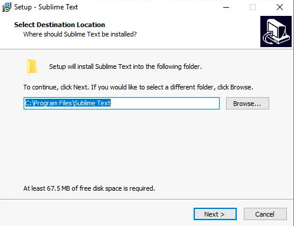
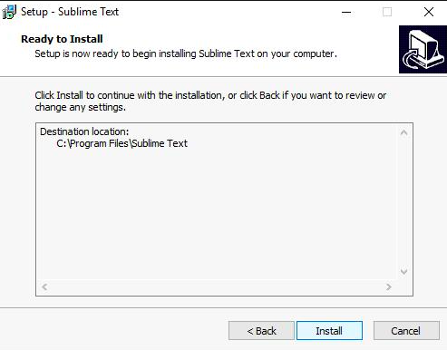
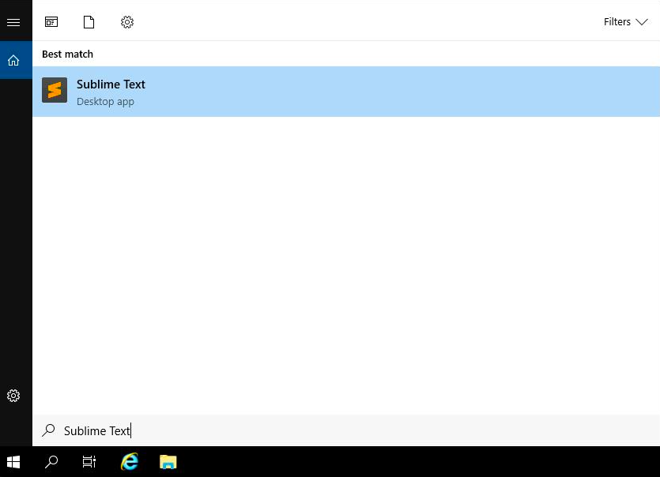
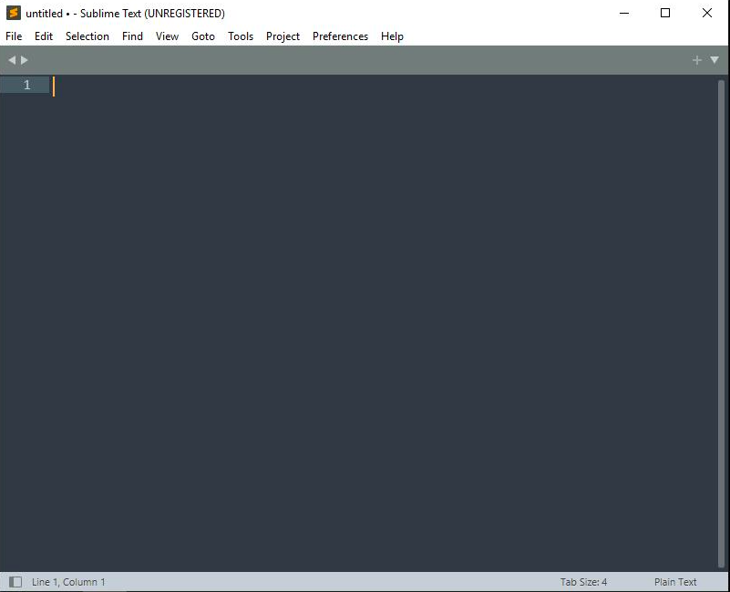
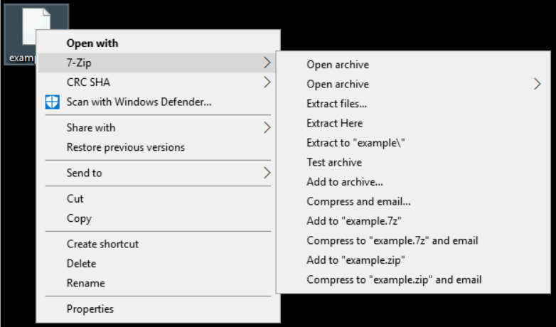
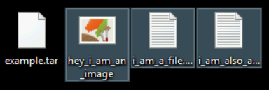
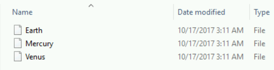
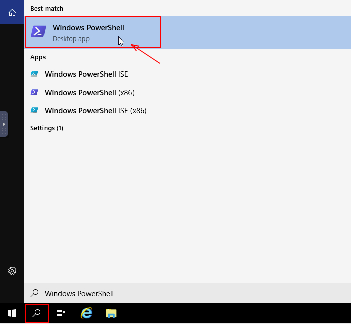

# Install and uninstall software using Windows GUI lab 

### Installing Sublime Text


First, you'll install the Sublime Text editor. Using Google Chrome, visit https://www.sublimetext.com to download the latest version of Sublime Text. Once you have downloaded the file, open your "Downloads" folder under C:\Users\qwiklabs\Downloads. You should see the installer, called "sublime_text_build_4126_x64_setup.exe". Double click the executable and the process should begin.



Leave the folder location as default, just click on the Next button to proceed with the installation.



Now, click on the Install button. When the installation is finished, click the Search icon in the bottom-left of the taskbar, and start typing “Sublime Text” to search (as shown below).



This will bring up the Sublime Text editor.



You won't need to use Sublime Text during this lab, so feel free to close the program. Later tater!

## Extracting using 7-Zip

7-Zip is a super useful program for working with archived or zipped files, and it's already been installed on your system. Using File Explorer navigate to "C:\Users\Qwiklab\Downloads". This folder contains a .tar archive called "example.tar". You don't have permissions to extract files in this .tar file's current folder, so click-and-drag the file to the Desktop. After moving the file, you'll be prompted to confirm the move; click "Continue" to finish the move. Then, you can use it to extract the contents of the archive by right-clicking "example.tar" (now on the Desktop), hovering over "7-Zip", and clicking "Extract Here":



Afterwards, you'll see the contents of the .tar file on the Desktop, alongside the archive:



## Archiving files

Now you'll perform the other half of the process, bundling multiple files into a .zip archive. Navigate to "C:\Users\Qwiklab\Documents" and find the three files named, "Earth", "Mercury", and "Venus":



#### Archiving files with Powershell


Now you'll build multiple files into a .zip archive using Powershell. Open Powershell and navigate to this folder. (Make sure you have administrative privileges enabled!). So, search for Windows Powershell, right-click it, and select "Run as Administrator".



Now, Use the following command:

```
cd C:\Users\Qwiklab\Documents\
```

to navigate to the "Documents" folder. Once you're there, you can create a .zip archive (called Planets.zip) using this command:

```
Compress-Archive -Path Earth, Mercury, Venus Planets.zip
```

## Install and uninstall software using Windows CLI

### Installing VLC

There are alternatives to manually downloading and running installers when you need to install or manage programs on Windows. To install or remove programs, you need administrative privileges. So, open Windows Powershell by searching for it in the Windows start menu, then right-click it and select "Run as Administrator".

In the Windows Powershell terminal, enter the following commands to download and install VLC media player.

```
$VLC_URL = "https://get.videolan.org/vlc/last/win64/"
```

```
$GET_HTML = Invoke-WebRequest $VLC_URL
```

```
$FILE = $GET_HTML.Links | Select-Object @{Label='href';Expression={@{$true=$_.href}[$_.href.EndsWith('win64.exe')]}} | Select-Object -ExpandProperty href
```

```
$URL = ($VLC_URL+$FILE)
```

```
$DOWNLOAD_DIR = "C:\users\qwiklabs\Downloads\"
```


```
$OUTPUT_FILE = ($DOWNLOAD_DIR+$FILE)
```

```
(new-object System.Net.WebClient).DownloadFile($URL, $OUTPUT_FILE)
```

```
cmd.exe /c $OUTPUT_FILE /S
```

Once the installation process is successfully completed, verify that VLC has successfully been installed with the following command:

```
Get-Package -Name *vlc*
```


OUTPUT: 

```
Name              Version  Source  ProviderName
----              -------  ------  ------------
VLC media player  3.0.16           Programs
```

## Uninstalling GIMP

You can use Windows Powershell to uninstall programs. If you've closed your Powershell window, reopen it again by searching for it in the Start Menu, then right-clicking it and selecting "Run as Administrator".

You can uninstall GIMP, a photo editor, using this command:

```
cmd.exe /c "C:\Program Files\GIMP 2\uninst\unins000.exe" /VERYSILENT /NORESTART
```

Once the process finishes, GIMP will no longer be available on your system. You can verify this with the following command and notice that GIMP is not listed:

```
Get-Package
```

## Conclusion

Congrats! You've successfully installed and uninstalled programs on Windows using both the GUI and CLI tools, as well as archived and unarchived .tar files.
